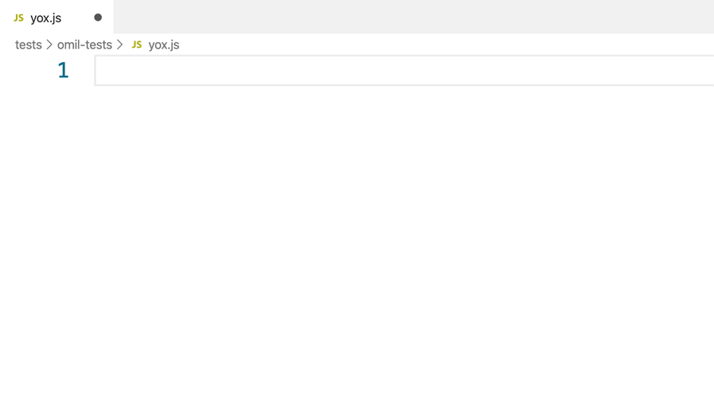

# Yox Snippets for Visual Studio Code

This extension adds Yox Code Snippets into Visual Studio Code.

这个插件基于最新的 Yox 的 API 添加了 Code Snippets。

# Snippets

Including most of the API of Yox. You can type `Yox`, choose `Yox.component`, and press ENTER, then `Yox.component(name, {...})` appear on the screen.

插件的 Snippets 如下表格所示，比如你可以键入 `Yox` 然后按上下键选中 `Yox.component` 再按 Enter 键，就输入了`Yox.component(name, {...})`了。

| Prefix | JavaScript Snippet Content |
| ------ | ------------ |
| `import` | `import ... from ...` |
| `newYox` | `new Yox({...})` |
| `addSpecialEvent` | `Yox.dom.addSpecialEvent(name, function (name, listener) {...})` |
| `Yox.dom.on` | `Yox.dom.on(node, event, listener)` |
| `Yox.dom.off` | `Yox.dom.off(node, event, listener)` |
| `Yox.dom.addClass` | `Yox.dom.addClass(node, className)` |
| `Yox.dom.removeClass` | `Yox.dom.removeClass(node, className)` |
| `Yox.directive` | `Yox.directive(name, { bind: function (node, directive, vnode) {...} })` |
| `Yox.component` | `Yox.component(name, {...})` |
| `Yox.filter` | `Yox.filter(name, function (value) {...})` |
| `Yox.transition` | `Yox.transition(name, { leave: function (node) {...} })` |
| `Yox.partial` | `Yox.partial(name, partial)` |
| `template` | `template: "..."` |
| `name` | `name: "..."` |
| `model` | `model: "..."` |
| `data` | `data: { key: value }` |
| `data` | `data: function () {...}` |
| `filters` | `filters: { definition: function (value) {...} }` |
| `computed` | `computed: { definition: function (value) {...} }` |
| `methods` | `methods: { definition: function (value) {...} }` |
| `watchers` | `watchers: { definition: function (value) {...} }` |
| `transitions` | `transitions: { enter: function (node) {...} }` |
| `directives` | `directives: { definition: function (value) {...} }` |
| `events` | `events: { definition: function (value) {...} }` |
| `partials` | `partials: {...}` |
| `propTypes` | `propTypes: {...}` |
| `components` | `components: {...}` |
| `beforeCreate` | `beforeCreate: function () {...}` |
| `afterCreate` | `afterCreate: function () {...}` |
| `beforeMount` | `beforeMount: function () {...}` |
| `afterMount` | `afterMount: function () {...}` |
| `beforeUpdate` | `beforeUpdate: function () {...}` |
| `afterUpdate` | `afterUpdate: function () {...}` |
| `beforeDestroy` | `beforeDestroy: function () {...}` |
| `afterDestroy` | `afterDestroy: function () {...}` |
| `this.$el` | `this.$el.xxx` |
| `this.$refs` | `this.$refs.xxx` |
| `this.$vnode` | `this.$vnode.xxx` |
| `this.$options` | `this.$options.xxx` |
| `this.nextTick` | `this.nextTick.xxx` |
| `this.copy` | `this.copy.xxx` |
| `this.toggle` | `this.toggle.xxx` |
| `this.increase` | `this.increase.xxx` |
| `this.decrease` | `this.decrease.xxx` |
| `this.append` | `this.append.xxx` |
| `this.prepend` | `this.prepend.xxx` |
| `this.insert` | `this.insert.xxx` |
| `this.remove` | `this.remove.xxx` |
| `this.removeAt` | `this.removeAt.xxx` |
| `console.log` | `console.log(...)` |
| `preventDefault` | `event.prevent()` |
| `stopPropagation` | `event.stop()` |

 

| Prefix | HTML Snippet Content |
| ------ | ------------ |
| `template` | `<template>...</template>` |
| `{{}}` | `{{ ... }}` |
| `{{!--}}` | `{{!-- ... --}}` |
| `on-event` | `on-...=...` |
| `o-directive` | `o-...=...` |
| `transition` | `transition="..."` |
| `#if` | `{{#if condition1}}...{{else if condition2}}...{{else}}...{{/if}}`|
| `#each` | `{{#each items: item}}...{{/each}}` |
| `#partial` | `{{#partial id}}...{{/partial}}` |
| `model` | `model="..."` |
| `<!--` | `<!-- ... -->` |

If you enjoy `Yox`, you should have it! Waiting for you in our heart！

If you think it's useful, you can leave us a [message and like it](https://marketplace.visualstudio.com/items?itemName=Wscats.yox&ssr=false#review-details), Your support is our driving force😀

# License

[Yox Snippets](https://marketplace.visualstudio.com/items?itemName=Wscats.yox) is released under the [MIT](http://opensource.org/licenses/MIT).